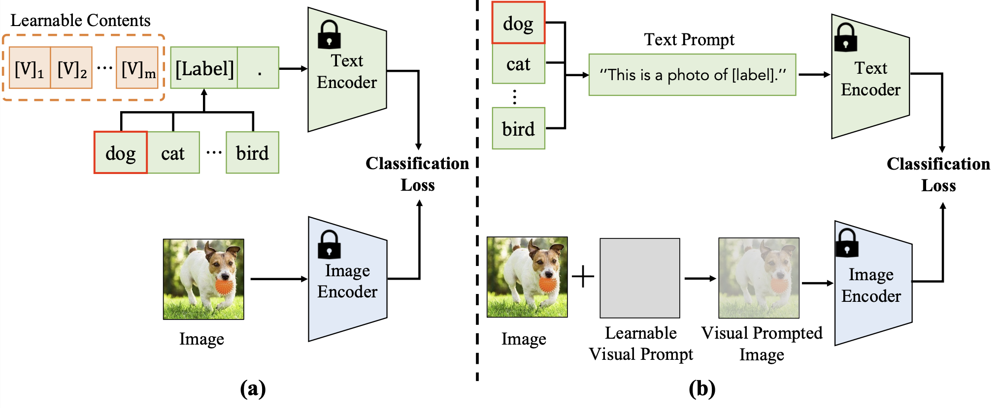
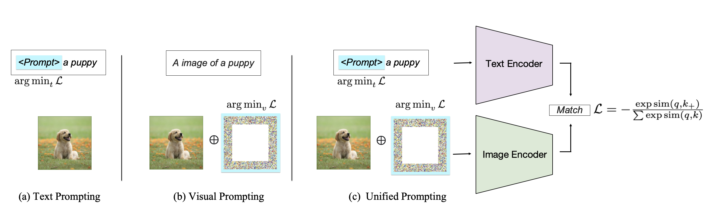

# Introduction of Prompt Tuning
Goal: Provide a brief introduction to Prompt Tuning and instructions for running the baseline method [Context Optimization (CoOp)](https://github.com/KaiyangZhou/CoOp)


## Index
1. [Introduction to Prompt Tuning](#1-introduction-to-prompt-tuning)
2. [Common Methods](#2-common-methods)
3. [Common Setups](#3-common-setups)
4. [Evaluation Metrics](#4-evaluation-metrics)
5. [How to Run CoOp](#5-how-to-run-coop)
6. [Further Readings](#6-further-readings)


## 1. Introduction to Prompt Tuning
Beyond zero-shot prediction, which directly applies pre-trained VLMs to downstream tasks without fine-tuning, transfer learning has recently been studied to adapt VLMs to downstream tasks.
This is achieved through methods like [prompt tuning](https://arxiv.org/abs/2109.01134) and [feature adapters](https://arxiv.org/abs/2110.04544), etc.
In this document, we focus on prompt tuning.

Inspired by "[prompt learning](https://arxiv.org/abs/2107.13586)" in NLP, many VLM prompt learning methods have been proposed to adapt VLMs to downstream tasks by finding optimal prompts without fine-tuning the entire VLM.
Most existing studies adopt one of three approaches: text prompt tuning, visual prompt tuning, or text-visual prompt tuning.


## 2. Common Methods
[](https://arxiv.org/abs/2304.00685)
[](https://arxiv.org/abs/2307.12980)
1. **Text Prompting**:
Unlike [prompt engineering](https://arxiv.org/abs/2107.13586), which designs text prompts for each task, prompt tuning learns text prompts using a small number of labeled downstream samples for each class.
For example, [CoOp](https://arxiv.org/abs/2109.01134) uses context optimization to learn context words for a single class name using learnable word vectors.
It expands a category word \[CLS\] into a sentence ‘\[V\]<sub>1</sub>, \[V\]<sub>2</sub>,..., \[V\]<sub>m</sub> \[CLS\]’, where \[V\] denotes the learnable vectors optimized by minimizing the classification loss.

2. **Visual Prompting**:
In contrast to text prompting, visual prompting modifies the input to the image encoder, as shown in Fig. (b).
Visual prompt tuning enables pixel-level adaptation for downstream tasks, which is especially beneficial for dense prediction tasks.

3. **Text-Visual(Unified) Prompting**:
Unified prompting optimizes both text and visual inputs simultaneously. This approach leverages the complementarity of the two modalities, resulting in improved performance across tasks.

## 3. Common Setups
There are three common setups for VLM transfer learning:
- **Supervised(fully)**: Uses all labeled downstream data to fine-tune pre-trained VLMs.
- **Few-shot supervised**: Employs only a small amount of labeled downstream data (typically 16 labeled samples per class), making it more annotation-efficient.
- **Unsupervised**: Utilizes unlabeled downstream data for fine-tuning VLMs, making it more challenging but also more promising and efficient for VLM transfer.

Prompt tuning is often applied in the few-shot learning setting.


## 4. Evaluation metrics
Evaluation metrics commonly used for VLMs, particularly in prompt tuning for image classification, include:

1. Zero-Shot Prediction:
Directly applies pre-trained VLMs without adaptation. In prompt tuning, this metric is used only for the original CLIP (Zero-shot CLIP).

2. Few-shot learing:
Evaluates performance using a small labeled dataset.

3. Base-to-novel generalization:
Assesses the model's ability to generalize from seen (base) to unseen (novel) classes.
Typically, the model is trained only on base classes and evaluated on both base and novel classes.
The harmonic mean is often used for this metric.
For more details, refer to the experimental section of [CoCoOp](https://arxiv.org/abs/2203.05557).

4. Domain generalization(domain shift or distribution shift):
Measures robustness to domain or distribution shifts such as normal banana image to cartoon-style banana.
Typically, models are trained on ImageNet and evaluated on domain-shifted datasets (e.g., ImageNetV2, ImageNet-Sketch, ImageNet-A, ImageNet-R).

5. Cross-dataset evaluation:
Tests the model's adaptability to datasets it has not been trained on. Typically, models are trained on ImageNet and evaluated on other datasets.


## 5. How to Run [CoOp](https://github.com/KaiyangZhou/CoOp)
For experiments, many studies are based on the implementation of CoOp.
Therefore, you can use the setup instructions for CoOp as a reference.
Follow the instructions provided in the [`README.md`](https://github.com/KaiyangZhou/CoOp/blob/main/README.md) file in the repository.

1. **Environment Setup**:
    ```bash
    # mkdir & clone repo
    mkdir prompt && cd prompt
    git clone https://github.com/KaiyangZhou/Dassl.pytorch.git
    git clone https://github.com/KaiyangZhou/CoOp.git

    # create conda env
    conda create -n prompt python=3.10
    conda activate prompt
    pip install torch==2.0.1 torchvision==0.15.2

    # setup dassl
    cd Dassl.pytorch/
    pip install -r requirements.txt
    pip install numpy==1.24.1
    python setup.py develop
    ```

2. **Datasets**:
    - Following the instructions in the [`DATASETS.md`](https://github.com/KaiyangZhou/CoOp/blob/main/DATASETS.md).
    - For 10 datasets (except ImageNet), you download files form [here]()
    - make your own dataset folders due to limit of home dir.
    ```
    cd /hdd/hdd2
    mkdir "name"
    cd "name"
    wget 
    tar -zxvf 10datasets.tar.gz
    ```

3. **Training**:
   - Make sure to specify the correct dataset paths in `CoOp/scripts/*/*.sh`.

    ```bash
    # run coop
    cd ../CoOp/
    CUDA_VISIBLE_DEVICES=0 bash scripts/coop/main.sh dtd vit_b16 end 16 16 False
    ```


## 6. Further Readings
This document is based on the insights from two survey papers: [A](https://arxiv.org/abs/2304.00685) and [B](https://arxiv.org/abs/2307.12980).
As many details are omitted here, if you have any questions or are curious about other methodologies, it is recommended to refer to Table 4 in Paper A and Section 6 (VLM Transfer Learning) for further information.

